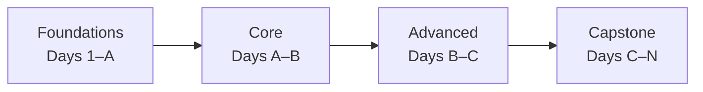

# /curriculum — Mastery Curriculum Generator

Vault root: `{{VAULT}}/`
Skill templates: `c:/Users/rushi/.claude/skills/curriculum/templates/`

---

## Invocation modes

| Command | Action |
|---------|--------|
| `/curriculum <goal>` | Research + generate full plan (first-time setup) |
| `/curriculum next` | Generate next undone day in the active curriculum |
| `/curriculum day <N>` | Generate (or regenerate) a specific day |
| `/curriculum list` | Show all curricula + progress summary |
| `/curriculum resume <slug>` | Switch active curriculum |
| `/curriculum audit <slug>` | Check concept coverage vs. generated days |
| `/curriculum replan` | Rewrite plan from next undone day (adaptive) |
| `/curriculum grade <N>` | Run grader for day N and append result to review |
| `/curriculum export <slug>` | Export shareable bundle (no personal progress) |
| `/curriculum import <path>` | Import a shared curriculum bundle |
| `/curriculum today` | Show/generate today's day based on schedule |

Parse the first word after `/curriculum` to dispatch. If the argument is none of the keywords above, treat the entire argument string as a `<goal>` and run the first-time setup flow.

---

## FLOW A — First-time setup: `/curriculum <goal>`

### A1. Scope-setting questions

Before any research, ask with `AskUserQuestion` (all four in one call):

1. **Time budget** — "How many hours/day and how many total days? (e.g. 1.5 h/day for 60 days)"
2. **Starting level** — "Your current level relative to this goal?" (beginner / some-exposure / intermediate / advanced)
3. **Learning bias** — "Prefer concept-heavy, practical-heavy, or balanced?"
4. **Done means** — "What does finishing look like? (e.g. build a deployable project / pass interview / ship to production / general understanding)"

Store answers. If user skips a question, use: 1 h/day · 30 days · balanced · general-understanding.

### A2. Research phase (parallel — single message, multiple tool calls)

Fan out simultaneously:

**A2a. WebSearch** (run all three queries in parallel):
- `"<goal> curriculum 2026"`
- `"<goal> complete roadmap beginner to advanced"`
- `"best resources to learn <goal> site:github.com OR site:reddit.com OR site:roadmap.sh"`

Additionally search for authoritative syllabi where applicable:
- deep learning / NLP / ML → search for fast.ai, DeepLearning.AI, Stanford CS229/CS224N
- data engineering → search for DataTalks.Club, Zoomcamp
- software systems → search for MIT 6.824, CMU 15-445

**A2b. context7** — for every framework/library the goal implies, resolve and query docs:
```
mcp__plugin_context7_context7__resolve-library-id  topic="<library name>"
mcp__plugin_context7_context7__query-docs  tokens=4000  topic="<library name> getting started overview"
```
For broad goals (e.g. "AI engineering"), hit the top 3–5 implied libraries.

**A2c. Vault graph** — run learningpath.py to find existing notes that already cover sub-topics:
```
python {{SCRIPTS}}/learningpath.py "<goal>" --top 15
```
Notes returned here become `[[wikilinks]]` in the plan instead of duplicated generated content.

Synthesize: merge topics from A2a + A2b, deduplicate, order by prerequisite dependency. Flag any conflicts between sources explicitly.

### A3. Generate concept tree

Before writing files, construct an exhaustive bulleted concept tree (all topics the goal requires, grouped by phase). Verify coverage by cross-checking against:
- The roadmap search results (A2a)
- The library docs overviews (A2b)
- Any authoritative syllabus found

This tree becomes the "no concepts missed" guarantee and seeds both `plan.md` and the day-by-day schedule.

### A4. Write plan files

**Slug:** goal lowercased, spaces → hyphens, punctuation stripped, max 60 chars.
Example: "learn AI engineering" → `learn-ai-engineering`

**Write `curricula/<slug>/plan.md`:**

```markdown
---
title: "Curriculum: <goal>"
created: <YYYY-MM-DD>
updated: <YYYY-MM-DD>
status: active
curriculum_id: <UUID v4>
tags: [curriculum, <topic-tag>]
goal: "<goal>"
time_budget: "<X h/day · N days>"
starting_level: <level>
bias: <concept|practical|balanced>
target_outcome: "<one line from user>
prerequisites: []
---

# Curriculum: <goal>

> [!tldr]
> Line 1: What you'll learn.
> Line 2: The path (Foundations → Core → Advanced → Capstone).
> Line 3: What the capstone delivers.

## Overview
- **Total time:** N days · ~M hours
- **Daily commitment:** X h/day
- **Phases:** Foundations (days 1–A) → Core (A–B) → Advanced (B–C) → Capstone (C–N)
- **Capstone:** <concrete deliverable description>

## Phase map



## Concept coverage

> Every concept in this curriculum. Concepts with a [[link]] are covered by existing vault notes — no new note needed.

### Phase 1 — Foundations
- Topic group
  - Concept A [[existing-note]] ← vault already covers this
  - Concept B ← will be generated day 2

### Phase 2 — Core
...

### Phase 3 — Advanced
...

### Capstone
- Deliverable: <description>
- Tech used: <list>
- Evaluation criteria: <how you know it's good>

## Day-by-day schedule

| Day | Phase | Topic | Key concepts | Practical | Est. | # notes |
|-----|-------|-------|-------------|-----------|------|---------|
| 1   | F     | ...   | ...         | ...       | Xh   | 1       |

## Datasets & tools

| Dataset | Source | Used in |
|---------|--------|---------|
| ...     | HuggingFace/`<name>` | day 5 |

| Tool | Version | Used in |
|------|---------|---------|
| ...  | ...     | days 3–7 |

## Reuses from vault

- [[note-id]] — covers day N concepts (no new file needed)

## Cross-curriculum prerequisites

<!-- populated if other curricula exist with overlapping topics -->

## Sources consulted

- <url> (accessed <YYYY-MM-DD>)
```

**Write `curricula/<slug>/progress.md`:**

```markdown
---
title: "Progress: <goal>"
created: <YYYY-MM-DD>
updated: <YYYY-MM-DD>
curriculum: "[[curricula/<slug>/plan]]"
active_day: 0
---

# Progress: <goal>

## Checklist

| Day | Concepts | Practical | Review | Grade | Notes |
|-----|----------|-----------|--------|-------|-------|
| 1   | ☐        | ☐         | ☐      | —     |       |

## Reflections

<!-- Add notes here as you go: what's easy, what's hard, what to replan -->
```

**Upsert `curricula/index.md`** (create if missing, else append entry):

```markdown
---
title: Curricula Index
active: <slug>
---

# Curricula

| Slug | Goal | Status | Days done | Started |
|------|------|--------|-----------|---------|
| [[curricula/<slug>/plan\|<slug>]] | <goal> | active | 0/<N> | <YYYY-MM-DD> |
```

**Generate `.ics` schedule** (ask first: "Generate a calendar .ics file for daily reminders?"):
If yes, write `curricula/<slug>/schedule.ics` with one VEVENT per day:
- SUMMARY: `Day N: <topic> — <goal> curriculum`
- DTSTART: today + (N-1) days at 08:00 local
- DURATION: time_budget hours
- DESCRIPTION: `obsidian://open?vault=llm-wiki-memory&file=curricula/<slug>/day-<NN>-concepts`

### A5. Check for prerequisite overlaps

After writing the plan, read `curricula/index.md`. For any other curricula listed:
1. Run `learningpath.py "<goal>"` to get tag intersection
2. If any day's tags appear in a completed curriculum's `progress.md`, add to `plan.md` prerequisites section and offer `/curriculum next --skip-known`

### A6. Present and confirm

Show the user:
- Phase map (Mermaid text)
- Day-by-day table (first 7 rows + "... N more days")
- Capstone description
- Count of vault notes reused (saves X days of generation)

Ask: "Generate day 1 now, or save the plan and stop here?"

---

## FLOW B — Day generation: `/curriculum next` / `/curriculum day <N>`

### B0. Resolve which day

- `next`: read `curricula/index.md` frontmatter `active:` to find slug, read `progress.md` to find lowest day where Concepts = ☐
- `day <N>`: use slug from `active:`, generate day N regardless of progress state
- `--skip-known`: read completed-curriculum `progress.md` files, find days in this curriculum whose concept tags are all ✓ in a prior curriculum, skip them

### B1. Per-day research (targeted)

Before generating, run targeted refresh for this day's topics:
- `WebSearch "<day topic> <goal> tutorial 2026"` 
- `context7` query for any library used in today's practical
This keeps each day current, not frozen at plan-creation time.

### B2. Write concept note(s) for day `<NN>`

#### B2a. Apply the split heuristic (deterministic)

Derive this day's concept set from the plan's "Key concepts" column for day N:

- **1 concept → 1 note:** write `day-<NN>-concepts.md` (original behavior, fully backward-compatible).
- **2–3 concepts → N notes:** write `day-<NN>-concepts-01-<topic-slug>.md`, `day-<NN>-concepts-02-<topic-slug>.md`, … — one atomic note per distinct concept, each fully self-contained (own declarative title, own diagram, own worked example, own when-not-to-use, own recall prompts). Do **not** also write a `day-<NN>-concepts.md`; the numbered notes are the concepts for this day. Use a short kebab-case slug for each topic (e.g. `day-07-concepts-01-attention-mechanism.md`).
- **>3 concepts in plan → warn + cap:** add a `> [!warning]` callout at the top of the first generated concept note: "Day <N> has >3 atomic concepts assigned in the plan. Only the first 3 are generated here — run `/curriculum replan` to redistribute the remaining concepts into adjacent days." Generate at most 3 concept notes.
- Set `needs_split: true` on any note that still covers more than one coherent concept. Otherwise `needs_split: false`.

**Within-day cross-linking for multi-note days:**
- Each `day-<NN>-concepts-0K` note's `## See also` links to adjacent notes: `concepts-0(K-1)` and `concepts-0(K+1)` within the same day.
- `day-<NN>-concepts-01` also links back to the previous day's last concept file; the last concept note links forward to next day's first concept file.
- `practical.md` and `review.md` `prerequisites:` list **all** this day's concept files (e.g. `["[[curricula/<slug>/day-<NN>-concepts-01-<slug>]]", "[[curricula/<slug>/day-<NN>-concepts-02-<slug>]]"]`).

#### B2b. Write each concept note

Type: `learning` (Concept). Must pass Universal U1–U7 + Concept add-ons per Quality Rubric v3. Apply the template below **once per concept note** (filename is `day-<NN>-concepts.md` for single-concept days, `day-<NN>-concepts-0N-<topic-slug>.md` for multi-concept days).

```markdown
---
title: "Day <N>: <declarative-claim-about-topic>"
created: <YYYY-MM-DD>
updated: <YYYY-MM-DD>
last_verified: <YYYY-MM-DD>
confidence: medium
provenance: generated+web
type: learning
maturity: seedling
needs_split: false
tags: [curriculum/<slug>, day-<NN>, <topic-tags>]
curriculum: "[[curricula/<slug>/plan]]"
day: <N>
phase: <foundations|core|advanced|capstone>
prerequisites: ["[[curricula/<slug>/day-<NN-1>-concepts]]"]
related: []
source: <primary source URL>
---

# Day <N>: <declarative title — states a claim, not just a noun>

> [!tldr]
> Line 1: Core idea in one sentence (written in own words, not copy-pasted).
> Line 2: Why it matters for <goal>.
> Line 3: What you can do after today.

## <Section per concept>

Explanation using concrete numbers. Never vague.

> [!example]
> Worked example with real numbers / real code output.
> Never use placeholder values like `<your_value>`.

## Why does this work?

Mechanistic explanation — the underlying reason, not just what it does.

## Diagram

```mermaid
<!-- process/architecture/flow diagram -->
```

## When NOT to use this

- Anti-pattern 1 (specific condition)
- Anti-pattern 2 (specific condition)

## See also

- [[curricula/<slug>/day-<NN-1>-concepts]] — prior day
- [[curricula/<slug>/day-<NN+1>-concepts]] — next day
- [[<vault-note>]] — related vault concept

## Recall prompts

> [!question] <One specific retrievable fact from today's concepts>

> [!answer]- <Concrete, specific answer — no vague generalities>

> [!question] When would you NOT use <X covered today>?

> [!answer]- <Specific anti-pattern with concrete condition>

> [!question] <Third prompt — mechanism or trade-off question>

> [!answer]- <Answer>
```

### B3. Write `day-<NN>-practical.md`

Type: `cookbook` (Procedure). Must pass Universal U1–U7 + Cookbook add-ons per Quality Rubric v3.

```markdown
---
title: "Day <N>: Build <concrete artifact> using <technique>"
created: <YYYY-MM-DD>
updated: <YYYY-MM-DD>
last_verified: <YYYY-MM-DD>
confidence: medium
provenance: generated+web
type: cookbook
maturity: seedling
needs_split: false
tags: [curriculum/<slug>, day-<NN>, practical, <topic-tags>]
curriculum: "[[curricula/<slug>/plan]]"
day: <N>
prerequisites: ["[[curricula/<slug>/day-<NN>-concepts]]"]
related: []
source: <dataset/library URL>
---

# Day <N>: <topic> — Practical

**Objective:** By the end of this practical you will have built `<concrete artifact>`.

## Setup

**Dataset:**
<!-- Prefer public: HuggingFace, Kaggle, sklearn built-ins, UCI.
     If none fits, generate fabricated data with a documented schema. -->

```python
# tested: <lib>==<version>
# How to get/generate the dataset
```

**Dependencies:**

```
# tested: <lib>==<version>
pip install <packages>
```

## Step 1 — <name>

What you're doing and why.

```python
# tested: <lib>==<version>
<code>
```

**Expected output:**
```
<actual expected output — not a placeholder>
```

## Step 2 — ...

...

## Checkpoint

Run this to verify your work so far:

```python
# tested: <lib>==<version>
<assertion or sanity check>
```

## Stretch goals

1. <harder extension>
2. <harder extension>

## What can go wrong

| Error / symptom | Cause | Fix |
|----------------|-------|-----|
| ...             | ...   | ... |

## See also

- [[curricula/<slug>/day-<NN>-concepts]] — today's concepts
- [[curricula/<slug>/day-<NN>-review]] — today's review

## Recall prompts

> [!question] What is the exact command / function call to <key step in this practical>?

> [!answer]- <concrete answer with version-pinned syntax>

> [!question] What breaks if you skip <critical step>?

> [!answer]- <specific failure mode>
```

### B4. Write `day-<NN>-review.md`

Type: `reference` (lookup/quiz). Must pass Universal U1–U7 + Reference add-ons per Quality Rubric v3.

```markdown
---
title: "Day <N>: <topic> — Self-check and spaced repetition"
created: <YYYY-MM-DD>
updated: <YYYY-MM-DD>
last_verified: <YYYY-MM-DD>
confidence: medium
provenance: generated
type: reference
maturity: seedling
tags: [curriculum/<slug>, day-<NN>, review]
curriculum: "[[curricula/<slug>/plan]]"
day: <N>
prerequisites: ["[[curricula/<slug>/day-<NN>-concepts]]", "[[curricula/<slug>/day-<NN>-practical]]"]
related: []
source: ""
---

# Day <N>: <topic> — Self-check and spaced repetition

> [!tldr]
> Line 1: What today covered.
> Line 2: Key idea to retain.
> Line 3: How to judge if you understood it.

## Self-check questions

| # | Question | Answer |
|---|----------|--------|
| 1 | ... | ... |
| 2 | ... | ... |

(5–10 rows; enough to cover every major concept from today)

## Recall prompts

> [!question] <Most important retrievable fact from today>

> [!answer]- <Specific, concrete answer>

> [!question] <Second key question — mechanism or when-not-to-use>

> [!answer]- <Answer>

> [!question] <Third question — connection to prior material>

> [!answer]- <Answer>

## Reflection

- What surprised you most today?
- What concept is still fuzzy?
- How does today's material connect to what came before?
- In two sentences, explain today's topic as if to a junior colleague.

## See also

- [[curricula/<slug>/day-<NN>-concepts]] — today's concepts
- [[curricula/<slug>/day-<NN>-practical]] — today's practical
- [[curricula/<slug>/day-<NN+1>-concepts]] — next day
```

### B5. Update progress and log

**Update `curricula/<slug>/progress.md`:**
- Tick Concepts = ✓, mark Practical and Review as ☐ (user completes those)
- Update `active_day` frontmatter to N

**Append to `wiki/log.md`:**
```
## [YYYY-MM-DD] curriculum | <slug> day <N>
- Topic: <topic>
- Files: day-<NN>-concepts*.md (<N> concept note(s)) · day-<NN>-practical.md · day-<NN>-review.md
- Research: <sources used>
```

---

## FLOW C — `/curriculum list`

Read `curricula/index.md`, then for each curriculum read its `progress.md` to get current `active_day`. Output:

```
## Your Curricula

| Curriculum | Goal | Status | Progress | Started |
|------------|------|--------|----------|---------|
| learn-ai-engineering | Learn AI Engineering | active | 5/60 days | 2026-05-20 |
| pandas-joins | Learn pandas joins | completed | 5/5 days | 2026-05-10 |
```

Mark active curriculum with ★.

---

## FLOW D — `/curriculum audit <slug>`

1. Read `curricula/<slug>/plan.md` — extract every concept from the concept tree (all bullet points not marked with `[[link]]`)
2. Glob `curricula/<slug>/day-*-concepts*.md` — extract H2 section headings from each file (covers both single-note `day-NN-concepts.md` and multi-note `day-NN-concepts-01-*.md` … `day-NN-concepts-0N-*.md`)
3. Diff: concepts promised in plan vs concepts found in generated files
4. Output a coverage report:

```
## Coverage audit: <slug>

✓ 34 concepts covered
⚠ 8 concepts not yet generated (days 12–15 not created yet)
✗ 2 concepts missing from generated days:
  - "attention masks" — promised in day 7 but not found in any day-07-concepts*.md
  - "gradient checkpointing" — promised in day 11 but not found in any day-11-concepts*.md
```

Offer to regenerate the flagged days.

---

## FLOW E — `/curriculum replan`

Called when user has marked days as "too easy / too hard / skipped" in `progress.md` reflections.

1. Read `progress.md` — find days with skip/hard/easy markers
2. Re-run A2 research with context: `"<goal> <topic> for <starting_level + delta> learner"`
3. Rewrite `plan.md` from `active_day + 1` forward, preserving completed days
4. Archive old plan: `mv curricula/<slug>/plan.md curricula/<slug>/plan.v<N>.md`
5. Write new `plan.md`
6. Report: "Replanned days X–N. Old plan archived to plan.v1.md."

---

## FLOW F — `/curriculum grade <N>`

1. Check if `curricula/<slug>/graders/day-<NN>-grader.py` exists
2. If yes: `python curricula/<slug>/graders/day-<NN>-grader.py`
3. Append result block to `day-<NN>-review.md`:
```markdown
## Grade result (auto)
- Ran: <YYYY-MM-DD>
- Result: PASS / FAIL
- Details: <grader output>
```
4. If no grader exists: generate one from the practical's "Expected output" blocks — write assertions for each checkpoint.

---

## FLOW G — `/curriculum export <slug>`

Generate `curricula/<slug>/SHARE.md` containing:
- Full `plan.md` content
- Concept tree (text only, no wikilinks to local vault)
- Dataset list + versions
- Practical objectives (not full code — just the "By the end..." line per day)
- `manifest.json` in the same folder: `{ "curriculum_id": "<uuid>", "goal": "...", "days": N, "datasets": [...], "tools": [...] }`

No personal `progress.md` content is included.

---

## FLOW H — `/curriculum import <path>`

1. Read `<path>/SHARE.md` or `<path>` if it's a single file export
2. Extract goal, days, datasets, tools
3. Create `curricula/<new-slug>/plan.md` from the import content
4. Write fresh `progress.md` (all days ☐)
5. Add to `curricula/index.md`
6. Confirm: "Imported '<goal>' as <new-slug>. Run `/curriculum next` to start generating days."

---

## FLOW I — `/curriculum today`

1. Read `curricula/index.md` active slug
2. Read `curricula/<slug>/plan.md` frontmatter `created:` + time_budget days
3. Compute target day = `(today - created).days + 1`
4. Check `progress.md` — is this day generated?
   - If yes: "Today is day N: <topic>. Files ready: [[day-NN-concepts]] (or [[day-NN-concepts-01-<slug>]] … for multi-note days) · [[day-NN-practical]] · [[day-NN-review]]"
   - If no: "Today is day N: <topic>. Generating now..." → run Flow B for day N

---

## FLOW J — `/curriculum resume <slug>`

Update `curricula/index.md` frontmatter `active:` to `<slug>`. Confirm: "Active curriculum set to <slug>. Run `/curriculum next` to continue from day N."

---

## Behavior rules (always apply)

1. **Anonymization** — never mention employer name in any generated file; use "our platform" / "our workload"
2. **No difficulty folders** — all days flat in `<slug>/`; level via frontmatter `phase:` field only. Each day has 1–3 atomic concept notes (`day-NN-concepts*.md` — see B2a), one practical, and one review
3. **Examples are concrete** — real numbers, real library names, real dataset rows; never `<placeholder>` or `<your_value>`
4. **Version-pin all code** — every code block starts with `# tested: lib==version`
5. **Quality Rubric v3** — apply U1–U7 universally + type-specific add-ons per note `type:`:
   - `day-NN-concepts*.md` (**each** atomic concept note) → type `learning`: U1–U7 + diagram + "Why does this work?" + when-not-to-use + recall prompts
   - `day-NN-practical.md` → type `cookbook`: U1–U7 + version-pinned code + what-can-go-wrong + prerequisite wikilink + recall prompts
   - `day-NN-review.md` → type `reference`: U1–U7 + structured table + see-also wikilinks + recall prompts
   - All files get `maturity: seedling` on creation; user promotes to `budding`/`evergreen` as they revise
6. **Recall prompts are mandatory** (U4) — every generated note gets 2–5 `> [!question]` / `> [!answer]-` pairs; this is the highest-evidence retention intervention
7. **Declarative titles** (U1) — titles state a claim ("Transformers use self-attention to relate tokens at any distance"), not a noun ("Attention Mechanism")
8. **Re-research per day** — do not reuse stale day-1 research; run targeted search before each day generation
9. **Shell for file ops** — any copy/move uses Bash `cp`/`mv`, never Write tool
10. **Log every action** to `wiki/log.md`
